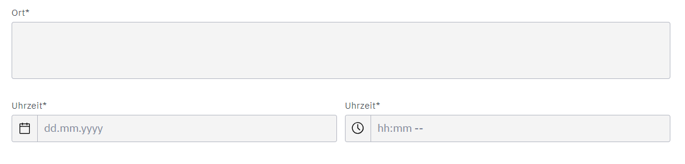

# M254

## Ziel des Prozesses
Unser Prozess schickt automatisch eine E-Mail an eine Person. In der E-Mail steht, wie das Wetter an einem bestimmten Ort und zu einer bestimmten Zeit ist. Ausserdem ist ein lustiger Dad-Joke dabei, damit man beim Lesen auch lachen kann. Das Ziel ist es also, bei der Planung von Aktivitäten das Wetter besser einschätzen zu können.

## Inbetriebnahme vom Prozess
Wir öffnen Docker Desktop und starten den Container. Danach deployen wir das BPMN-Modell lokal über `localhost`. Anschliessend öffnen wir im Browser die Seiten `localhost:8081` für Camunda Operate und `localhost:8082` für die Tasklist.

## Bedienung vom Prozess
Wenn wir den Prozess starten, erscheint zuerst ein Formular. Dort tragen wir ein, wo wir uns befinden und wann wir das Wetter wissen möchten. Danach holt sich der Prozess automatisch die Wetterdaten und einen Dad-Joke. Anschliessend erscheint ein weiteres Formular mit einer Checkbox, bei der wir bestätigen können, ob die E-Mail wirklich gesendet werden soll. Wenn wir zustimmen, wird die E-Mail mit dem Wetter und dem Witz verschickt.

## Funktionsweise des Prozesses
Der Prozess beginnt mit einem Formular, in dem wir den Ort und die Uhrzeit angeben. Danach ruft der Prozess über die OpenWeatherMap-API die Wetterdaten ab und fragt zusätzlich bei der icanhazdadjoke-API einen lustigen Witz an. Bevor die E-Mail versendet wird, erscheint ein weiteres Formular mit einer Checkbox. Dort entscheiden wir, ob wir die E-Mail wirklich erhalten möchten. Wenn wir die Checkbox aktivieren, wird die Nachricht erstellt und an die angegebene E-Mail-Adresse gesendet. Wenn wir sie nicht aktivieren, wird der Prozess ohne E-Mail beendet.

## Probleme mit AWS
Wir haben anfangs versucht, den Prozess mit AWS auszuführen. Dabei hatten wir jedoch viele Probleme, insbesondere mit Camunda Operate und der Tasklist. Ein grosser Teil unserer Zeit ging für ein Problem drauf, das wir am Ende nicht lösen konnten. Obwohl wir alle Einstellungen in AWS überprüft haben, blieb der Prozess nach dem User Task beim Wetterabrufen einfach stehen – ohne eine Fehlermeldung. Schliesslich haben wir den Prozess lokal mit Docker Desktop umgesetzt. Damit hat es funktioniert, aber wir haben dadurch viel Zeit verloren.

## Probleme mit SendGrid-Mail
Wir haben einen SendGrid-Account eingerichtet, einen API-Key erstellt und einen verifizierten Absender hinzugefügt. Dann haben wir den Mailversand mit dem SendGrid Outbound Connector in Camunda eingebaut. In Camunda Operate wurde der Prozess korrekt bis zum Ende durchlaufen. Trotzdem haben wir keine E-Mail erhalten. Im SendGrid-Dashboard sahen wir, dass vier Requests angekommen sind, aber keine E-Mail zugestellt wurde. Leider reichte die Zeit nicht mehr aus, um dieses Problem vollständig zu lösen.

##  Screenshots von allen Teilen

### Start und User Task

#### Form für User Task

### API für Wetterdaten und Dad Joke

### Gateway bei Ja/Nein

### SendGrid Mail

